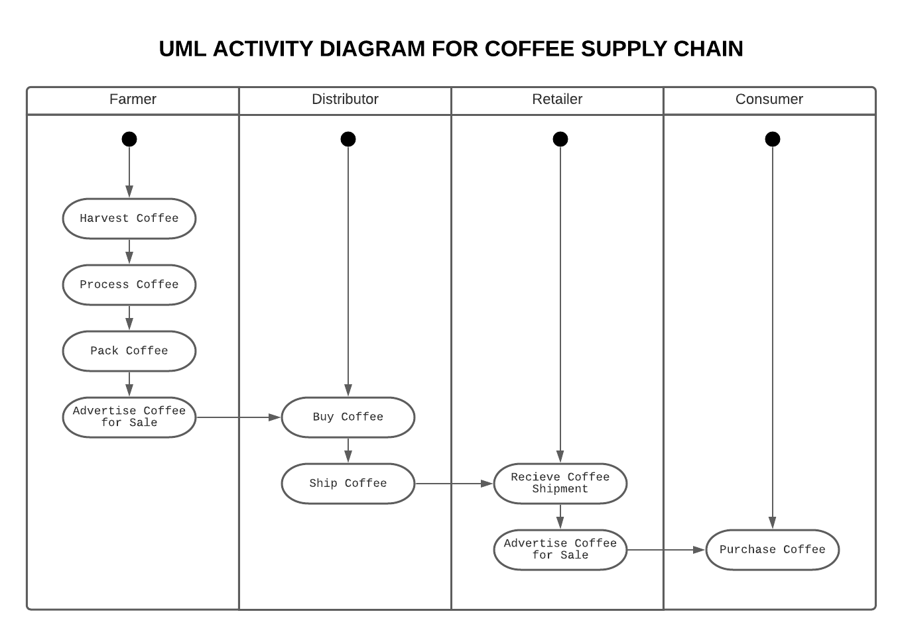
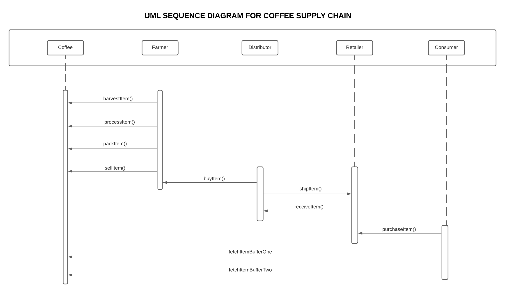
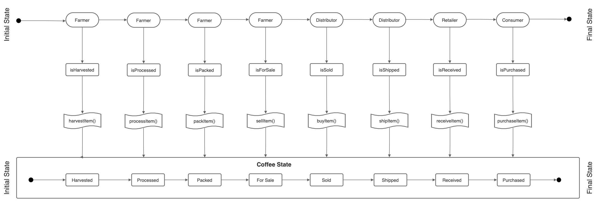
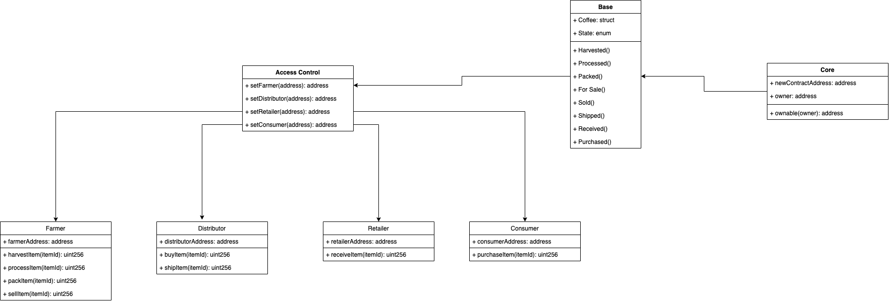

- [Project: Blockchain Architecture - Build Ethereum Dapp for Tracking Items through Supply Chain](#course-3-project-blockchain-architecture---build-ethereum-dapp-for-tracking-items-through-supply-chain)
  - [Part 1: Plan the project with write-ups](#part-1-plan-the-project-with-write-ups)
    - [1.1 Project write-up - UML](#11-project-write-up---uml)
    - [1.2 Project write-up - Libraries](#12-project-write-up---libraries)
    - [1.3 Project write-up - IPFS](#13-project-write-up---ipfs)
    - [1.4 Contract Details](#14-contract-details)
- [Part 2: Frontend Application](#frontend)
  - [2.1 Screenshots](#frontend-screenshots)
- [Notes](#notes)

# Course 3 Project: Blockchain Architecture - Build Ethereum Dapp for Tracking Items through Supply Chain

For this project, you will creating a DApp supply chain solution backed by the Ethereum platform. You will architect smart contracts that manage specific user permission controls as well as contracts that track and verify a product’s authenticity.

## Part 1: Plan the project with write-ups

### 1.1 Project write-up - UML

Project write-up include the following UML diagrams:

|        Diagram        | Details                       | Status |
| :-------------------: | :---------------------------- | :----: |
|       Activity        |  |   ✅   |
|       Sequence        |  |   ✅   |
|         State         |     |   ✅   |
| Class (Data Model) |     |   ✅   |

### 1.2 Project write-up - Libraries

Libraries which were adopted for the project.

|         Libraries         | Versions |                                                                   Details                                                                    | Status |
| :-----------------------: | :------- | :------------------------------------------------------------------------------------------------------------------------------------------: | :----: |
|          truffle          | v5.4.2   | Truffle is a development environment, testing framework and asset pipeline for Ethereum, aiming to make life as an Ethereum developer easier |   ✅   |
|    truffle-assertions     | ^0.9.2   |               This package adds additional assertions that can be used to test Ethereum smart contracts inside Truffle tests.                |   ✅   |
| truffle-hdwallet-provider | ^1.0.17  |              HD Wallet-enabled Web3 provider. Use it to sign transactions for addresses derived from a 12 or 24 word mnemonic.               |   ✅   |
|           node            | 14.17.0  |                                   Node.js® is a JavaScript runtime built on Chrome's V8 JavaScript engine.                                   |   ✅   |
|           web3            | 1.2.1    |                               This is the Ethereum JavaScript API which connects to the Generic JSON-RPC spec.                               |   ✅   |

### 1.3 Project write-up - IPFS

This project did not utilise IPFS

### 1.4 Contract Details

A general write up exists to items like steps and contracts address.

|          Item          |                          Transaction Hash                          | Contract Address                           | Status |
| :--------------------: | :----------------------------------------------------------------: | :----------------------------------------- | :----: |
| Smart Contract Address | 0x979c4db790797acde30160374380aed5489b01ff26502638efa0fe7efebebb3b | 0x435B709A7e57c9D1baB580fEDFe58DA31551e8C4 |   ✅   |
|     Farmer Address     | 0x9594ec10bd7d6c7a9db8409453db0060562355a127a0f3ca639762781e1d91fb | 0xfa51931ad376Ce0869064d3749d880E387E955A4 |   ✅   |
|  Distributor Address   | 0x8925eb2157f901dfcd1e6490adf7c5e9f7ebf3113f5be4c837fe6d03e6490b55 | 0x6f4A713e689A519120186e0ecEb9253cE4e09D9e |   ✅   |
|    Retailer Address    | 0xdc5d6179253a6fbdc10177d2f55e1a129ce8152fecdd7833226c9d985dac9240 | 0x5fE54b951ec4a4Bf255206f88F4E1cfb1095616F |   ✅   |
|    Consumer Address    | 0x979c4db790797acde30160374380aed5489b01ff26502638efa0fe7efebebb3b | 0x435B709A7e57c9D1baB580fEDFe58DA31551e8C4 |   ✅   |

# Part 2: Frontend Application

## 2.1 Screenshots

## Notes

- The application relies on the presence of a .infura file holding your Infura Key and a .secret file holding your MetaMask account mnemonic
